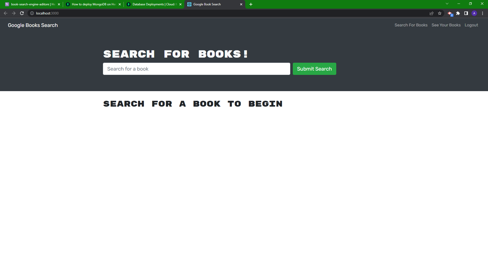

# bookSearchEngine

## Description

This application is a book search engine where a user can find books through Google books API.</br>
A user can sign up, log in and save books for easier access after searching for them.</br>
A user can also remove books from their list.</br>
Starter code was refactored to be able to successfully use Apollo Server and GraphQL.</br> 

## Learned

- Utilize Apollo Server and GraphQL
- Understand authorization with JWT
- Understand Queries and Mutations
- Creating hooks with GraphQL
- Deploy MongoDB to Heroku

## Table of Contents

- [Description](#description)
- [Learned](#learned)
- [Installation](#installation)
- [Usage](#usage)
- [Credits](#credits)
- [Features](#features)

## Installation

To install, clone or fork the repo and run `npm install` in your terminal!

NPM | Package
--- | ---
@testing-library/jest-dom | Client
@testing-library/react | Client
@testing-library/user-event | Client
bootstrap | Client
react | Client
react-bootstrap | Client
react-dom | Client
react-router-dom | Client
react-scripts | Client
graphql | Client/Server
jwt-decode | Client
apollo-server-express | Server
bcrypt | Server
express | Server
jsonwebtoken | Server
mongoose | Server
nodemon | Server
concurrently | Application

## Usage



```md
GIVEN a book search engine
WHEN I load the search engine
THEN I am presented with a menu with the options Search for Books and Login/Signup and an input field to search for books and a submit button
WHEN I click on the Search for Books menu option
THEN I am presented with an input field to search for books and a submit button
WHEN I am not logged in and enter a search term in the input field and click the submit button
THEN I am presented with several search results, each featuring a book’s title, author, description, image, and a link to that book on the Google Books site
WHEN I click on the Login/Signup menu option
THEN a modal appears on the screen with a toggle between the option to log in or sign up
WHEN the toggle is set to Signup
THEN I am presented with three inputs for a username, an email address, and a password, and a signup button
WHEN the toggle is set to Login
THEN I am presented with two inputs for an email address and a password and login button
WHEN I enter a valid email address and create a password and click on the signup button
THEN my user account is created and I am logged in to the site
WHEN I enter my account’s email address and password and click on the login button
THEN I the modal closes and I am logged in to the site
WHEN I am logged in to the site
THEN the menu options change to Search for Books, an option to see my saved books, and Logout
WHEN I am logged in and enter a search term in the input field and click the submit button
THEN I am presented with several search results, each featuring a book’s title, author, description, image, and a link to that book on the Google Books site and a button to save a book to my account
WHEN I click on the Save button on a book
THEN that book’s information is saved to my account
WHEN I click on the option to see my saved books
THEN I am presented with all of the books I have saved to my account, each featuring the book’s title, author, description, image, and a link to that book on the Google Books site and a button to remove a book from my account
WHEN I click on the Remove button on a book
THEN that book is deleted from my saved books list
WHEN I click on the Logout button
THEN I am logged out of the site and presented with a menu with the options Search for Books and Login/Signup and an input field to search for books and a submit button  
```

## Credits

See the deployed page at: </br>

Starter Code By: UW-Bootcamp</br>
Code within application by: Anthony Ditore</br>
Github: [aditore](https://github.com/aditore)</br>

This app was created with create-react-app

## Features

- REACT
- Google Books API
- MongoDB